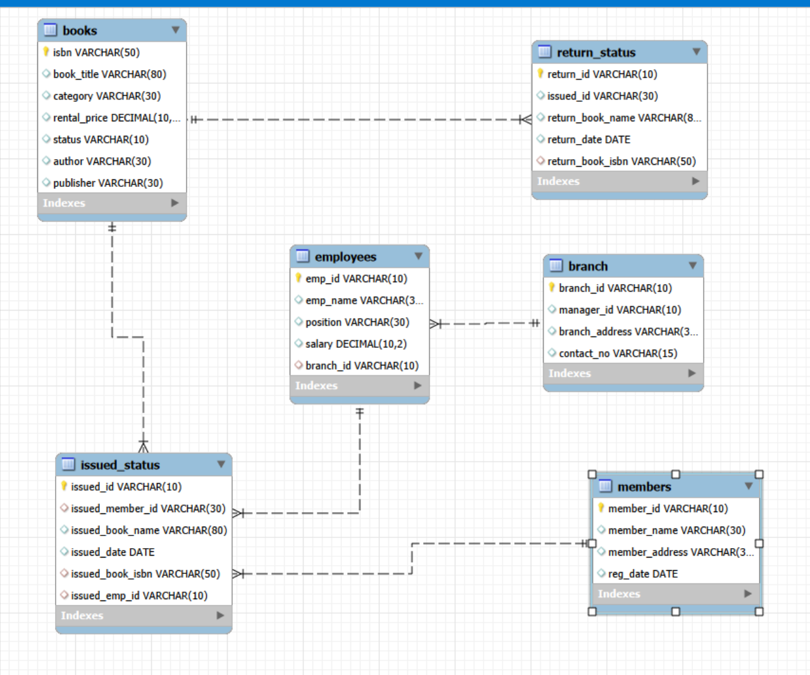

Markdown
**Library Management System using SQL Project -- P2**

**Project Overview**

This project illustrates how to use SQL to construct a library management system. It involves running advanced SQL queries, carrying out CRUD tasks, and building and maintaining tables. The objective is to demonstrate expertise in creating a database, manipulation, and querying.

**Objectives**

- **Set up the Library Management System Database**: Create and populate the database with tables for branches, employees, members, books, issued status, and return status.
- **CRUD Operations**: Perform Create, Read, Update, and Delete operations on the data.
- **CTAS (Create Table As Select)**: Utilize CTAS to create new tables based on query results.
- **Advanced SQL Queries**: Develop complex queries to analyze and retrieve specific data.

**Project Structure**

- **Database Creation and Table Creation**
  - Created a database/ schema named \`p2_library_management_system\`.
  - Created tables for branches, employees, members, books, issued status, and return status. Each table includes relevant columns and relationships.

\-- Library Management System

CREATE DATABASE p2_library_management_system;

\-- create table "branch"

DROP TABLE IF EXISTS branch;

CREATE TABLE branch

(

branch_id VARCHAR(10) PRIMARY KEY,

manager_id VARCHAR(10),

branch_address VARCHAR(80),

contact_no VARCHAR(15)

);

\-- create table "employees"

DROP TABLE IF EXISTS employees;

CREATE TABLE employees

(

emp_id VARCHAR(10) PRIMARY KEY,

emp_name VARCHAR(30),

position VARCHAR(30),

salary DECIMAL(10,2),

branch_id VARCHAR(10),

FOREIGN KEY (branch_id) REFERENCES branch(branch_id)

);

\-- create table "members"

DROP TABLE IF EXISTS members;

CREATE TABLE members

(

member_id VARCHAR(10) PRIMARY KEY,

member_name VARCHAR(30),

member_address VARCHAR(80),

reg_date DATE

);

\-- create table "books"

DROP TABLE IF EXISTS books;

CREATE TABLE books

(

isbn VARCHAR(50) PRIMARY KEY,

book_title VARCHAR(80),

category VARCHAR(30),

rental_price DECIMAL(10,2),

status VARCHAR(10),

author VARCHAR(30),

publisher VARCHAR(30)

);

\-- create table "issue status"

DROP TABLE IF EXISTS issued_status;

CREATE TABLE issued_status

(

issued_id VARCHAR(10) PRIMARY KEY,

issued_member_id VARCHAR(10),

issued_book_name VARCHAR(80),

issued_date DATE,

issued_book_isbn VARCHAR(50),

issued_emp_id VARCHAR(10),

FOREIGN KEY (issued_member_id) REFERENCES members(member_id),

FOREIGN KEY (issued_emp_id) REFERENCES employees(emp_id),

FOREIGN KEY (issued_book_isbn) REFERENCES books(isbn)

);

\-- create table "retrun status"

DROP TABLE IF EXISTS return_status;

CREATE TABLE return_status

(

return_id VARCHAR(10) PRIMARY KEY,

issued_id VARCHAR(30),

return_book_name VARCHAR(80),

return_date DATE,

return_book_isbn VARCHAR(50),

FOREIGN KEY (return_book_isbn) REFERENCES books(isbn)

);

- **CRUD Operations**

- **Create a New Book Record"('978-1-60129-456-2', 'To Kill a Mockingbird', 'Classic', 6.00, 'yes', 'Harper Lee', 'J.B. Lippincott & Co.')"**

INSERT INTO books

(

isbn,

book_title,

category,

rental_price,

status,

author,

publisher

)

VALUES ('978-1-60129-456-2', 'To Kill a Mockingbird', 'Classic', 6.00, 'yes', 'Harper Lee', 'J.B. Lippincott & Co.');

SELECT \* FROM books;

- **Retrieve All Books Issued by a Specific Employee -- Objective: Select all books issued by the employee with emp_id = 'E101'**

SELECT \* FROM issued_status

WHERE issued_emp_id = 'E101';

- **Update an Existing Member's Address with id 'C103' has changed to '125 Oak st'.**

UPDATE members

SET member_address = '125 Oak st'

WHERE member_id = 'C103';

SELECT \* FROM members

WHERE member_id = 'C103';

- **Delete a Record from the Issued Status Table. Objective: Delete the record with issued_id = 'IS121' from the issued_status table.**

DELETE FROM issued_status

WHERE issued_id = 'IS121';

- **List Members Who Have Issued More Than One Book -- Objective: Use GROUP BY to find members who have issued more than one book.**

SELECT issued_member_id AS book_members,

COUNT(\*) as count

FROM issued_status

GROUP BY 1

HAVING COUNT(\*) > 1;

- **CTAS (Create Table As Select)**

**Create Summary Tables: Used CTAS to generate new tables to join columns from 2 tables based on query results - each book and total book_issued_cnt**

CREATE TABLE book_issued_cnt AS

SELECT b.isbn, b.book_title, COUNT(ist.issued_id) AS issue_count

FROM issued_status AS ist

JOIN books AS b

ON ist.issued_book_isbn = b.isbn

GROUP BY b.isbn, b.book_title;SELECT \* FROM books;

- **Data Analysis & Findings**

The following SQL queries were used to address specific questions which uses Intermediate SQL operations.

- **Find Total Rental Income by Category**

SELECT

b.category,

COUNT(\*) AS count,

SUM(b.rental_price)

FROM

issued_status AS ist

JOIN

books AS b

ON b.isbn = ist.issued_book_isbn

GROUP BY 1;

- **List Members Who Registered in the Last 180 Days:**

SELECT member_name, reg_date

FROM members

WHERE reg_date >= CURRENT_DATE() - INTERVAL 180 DAY;

\-- this query gives a blank output because

SELECT MAX(reg_date) FROM members;

\-- the latest date is 2024-06-01, which is more than the 180 days from current date

\-- hence use the below query to find the data from the latest of 180 days from the table.

SELECT member_name, reg_date

FROM members

WHERE reg_date >= (

SELECT

MAX(reg_date) - INTERVAL 180 DAY

FROM members

)

;

- **List Employees with Their Branch Manager's Name and their branch details:**

SELECT

e1.emp_id,

e1.emp_name,

e1.position,

b.\*,

e2.emp_name AS manager_name-- manager's name

FROM employees AS e1

JOIN

branch AS b

ON e1.branch_id = b.branch_id

JOIN

employees AS e2

ON e2.emp_id = b.manager_id;

- **Retrieve the List of Books Not Yet Returned**

SELECT \* FROM issued_status AS ist

LEFT JOIN return_status AS rst

ON ist.issued_book_isbn = rst.return_book_isbn

WHERE rst.return_book_isbn IS NULL;

- **Advanced SQL Operations**

- **Identify Members with Overdue Books  
    Write a query to identify members who have overdue books (assume a 30-day return period). Display the member's_id, member's name, book title, issue date, and days overdue.**

\-- the following needs to be done

\-- join issued_status, members, books and return_status

\-- filter out the table that has null return_status

SELECT

ist.issued_member_id,

m.member_name,

b.book_title,

ist.issued_date,

DATEDIFF(CURDATE(), ist.issued_date) AS days_pending

FROM issued_status AS ist

JOIN members AS m

ON m.member_id = ist.issued_member_id

JOIN books AS b

ON b.isbn = ist.issued_book_isbn

LEFT JOIN return_status AS rst

ON rst.issued_id = ist.issued_id

WHERE

rst.return_date IS NULL

AND DATEDIFF(CURDATE(), ist.issued_date) > 30

ORDER BY ist.issued_member_id;

- **Update Book Status on Return**  
    **Write a query to update the status of books in the books table to "Yes" when they are returned (based on entries in the return_status table).**

DELIMITER \$\$

DROP PROCEDURE IF EXISTS add_return_record \$\$

CREATE PROCEDURE add_return_records

(

IN p_return_id VARCHAR(10),

IN P_issued_id VARCHAR(10),

IN p_book_quality VARCHAR(10)

)

BEGIN

DECLARE v_isbn VARCHAR(50); -- like call by reference

DECLARE v_book_name VARCHAR(80); -- like call by reference

\-- insert return record

INSERT INTO return_status (return_id, issued_id, return_date, book_quality)

VALUES (p_return_id, p_issued_id, CURDATE(), p_book_quality);

\-- fetch book details

SELECT issued_book_isbn, issued_book_name

INTO v_isbn, v_book_name

FROM issued_status

WHERE issued_id = p_issued_id

LIMIT 1;

\-- update book status

UPDATE books

SET status = 'yes'

WHERE isbn = v_isbn;

\-- message output

SELECT CONCAT('Thank you for returning the book: ', v_book_name) AS message;

END \$\$

DELIMITER ;

\-- Testing FUNCTION add_return_records

SELECT \* FROM books

WHERE isbn = '978-0-307-58837-1';

SELECT \* FROM issued_status

WHERE issued_book_isbn = '978-0-307-58837-1';

SELECT \* FROM return_status

WHERE issued_id = 'IS135';

CALL add_return_records('RS138', 'IS135', 'Good');

SHOW PROCEDURE STATUS WHERE Name = 'add_return_records';

- **Branch Performance Report  
    Create a query that generates a performance report for each branch, showing the number of books issued, the number of books returned, and the total revenue generated from book rentals.**

CREATE TABLE branch_reports

AS

SELECT

b.branch_id,

b.manager_id,

COUNT(ist.issued_id) AS num_of_books_issued,

COUNT(rst.return_id) AS num_of_books_returned,

SUM(bk.rental_price) AS total_revenue

FROM issued_status AS ist

JOIN

employees AS e

ON

e.emp_id = ist.issued_emp_id

JOIN

branch AS b

ON

e.branch_id = b.branch_id

LEFT JOIN

return_status AS rst

ON

rst.issued_id = ist.issued_id

JOIN

books AS bk

ON

ist.issued_book_isbn = bk.isbn

GROUP BY 1,2;

SELECT \* FROM branch_reports;

- **CTAS: Create a Table of Active Members  
    Use the CREATE TABLE AS (CTAS) statement to create a new table active_members containing members who have issued at least one book in the last 2 months.**

CREATE TABLE active_members

AS

SELECT

DISTINCT m.member_id,

m.member_name,

ist.issued_book_name,

ist.issued_date

FROM members AS m

JOIN issued_status AS ist

ON m.member_id = ist.issued_member_id

WHERE ist.issued_date >= (SELECT MAX(issued_date) - INTERVAL 2 MONTH FROM issued_status);

SELECT \* FROM active_members;

- **Find Employees with the Most Book Issues Processed  
    Write a query to find the top 3 employees who have processed the most book issues. Display the employee name, number of books processed, and their branch.**

SELECT

e.emp_id,

e.emp_name,

e.position,

b.branch_id,

b.branch_address,

COUNT(ist.issued_id) AS num_of_books_processed

FROM issued_status AS ist

JOIN employees AS e

ON e.emp_id = ist.issued_emp_id

JOIN branch AS b

on e.branch_id = b.branch_id

GROUP BY 1

ORDER BY 6 DESC

LIMIT 3;

- **Identify Members Issuing High-Risk Books  
    Write a query to identify members who have issued books more than twice with the status "damaged" in the books table. Display the member name, book title, and the number of times they've issued damaged books.**

**\-- insert values in rows using aggregate function**

**\-- method 1**

INSERT INTO issued_status(issued_id, issued_member_id, issued_book_name, issued_date, issued_book_isbn, issued_emp_id)

SELECT

'IS151', 'C118', 'The Catcher in the Rye', MAX(issued_date) - INTERVAL 24 DAY, '978-0-553-29698-2', 'E108'

FROM issued_status;

INSERT INTO issued_status(issued_id, issued_member_id, issued_book_name, issued_date, issued_book_isbn, issued_emp_id)

SELECT

'IS152', 'C119', 'The Catcher in the Rye', MAX(issued_date) - INTERVAL 13 DAY, '978-0-553-29698-2', 'E109'

FROM issued_status;

INSERT INTO issued_status(issued_id, issued_member_id, issued_book_name, issued_date, issued_book_isbn, issued_emp_id)

SELECT

'IS153', 'C106', 'Pride and Prejudice', MAX(issued_date) - INTERVAL 7 DAY, '978-0-14-143951-8', 'E107'

FROM issued_status;

INSERT INTO issued_status(issued_id, issued_member_id, issued_book_name, issued_date, issued_book_isbn, issued_emp_id)

SELECT

'IS154', 'C105', 'The Road', MAX(issued_date) - INTERVAL 32 DAY, '978-0-375-50167-0', 'E101'

FROM issued_status;

**\-- method 2**

SELECT MAX(issued_date) INTO @max_date FROM issued_status;

INSERT INTO issued_status VALUES

('IS151', 'C118', 'The Catcher in the Rye', @max_date - INTERVAL 24 DAY, '978-0-553-29698-2', 'E108'),

('IS152', 'C119', 'The Catcher in the Rye', @max_date - INTERVAL 13 DAY, '978-0-553-29698-2', 'E109'),

('IS153', 'C106', 'Pride and Prejudice', @max_date - INTERVAL 7 DAY, '978-0-14-143951-8', 'E107'),

('IS154', 'C105', 'The Road', @max_date - INTERVAL 32 DAY, '978-0-375-50167-0', 'E101');

**\-- Adding new column in return_status**

ALTER TABLE return_status

ADD Column book_quality VARCHAR(15) DEFAULT('Good');

**\-- changing a row to damaged as in the original data there were no more than 1 damaged book for the same id.**

UPDATE return_status

SET book_quality = 'Damaged'

WHERE issued_id

IN ('IS112', 'IS117', 'IS118');

**\--actual query to complete the task**

SELECT

m.member_name,

ist.issued_book_name AS book_title,

COUNT(\*) AS damaged_count

FROM issued_status AS ist

JOIN members AS m

ON m.member_id = ist.issued_member_id

JOIN return_status AS rst

ON rst.issued_id = ist.issued_id

WHERE rst.book_quality = 'Damaged'

GROUP BY

m.member_name,

ist.issued_book_name

HAVING COUNT(\*) > 2

ORDER BY damaged_count DESC;

- **Stored Procedure Objective: Create a stored procedure to manage the status of books in a library system. Description: Write a stored procedure that updates the status of a book in the library based on its issuance. The procedure should function as follows: The stored procedure should take the book_id as an input parameter. The procedure should first check if the book is available (status = 'yes'). If the book is available, it should be issued, and the status in the books table should be updated to 'no'. If the book is not available (status = 'no'), the procedure should return an error message indicating that the book is currently not available.**

DELIMITER \$\$

DROP PROCEDURE IF EXISTS issue_book \$\$

CREATE PROCEDURE issue_book

(

p_issued_id VARCHAR(10),

p_issued_member_id VARCHAR(30),

p_issued_book_isbn VARCHAR(30),

p_issued_emp_id VARCHAR(10)

)

BEGIN

\-- user invoked variable

DECLARE v_status VARCHAR(10);

\-- all the code

\-- checking if book is available 'yes'

SELECT

status

INTO

v_status

FROM books

WHERE isbn = p_issued_book_isbn;

IF v_status = 'yes' THEN

INSERT INTO issued_status

(

issued_id,

issued_member_id,

issued_date,

issued_book_isbn,

issued_emp_id

)

VALUES

(

p_issued_id,

p_issued_member_id,

CURRENT_DATE,

p_issued_book_isbn,

p_issued_emp_id

);

UPDATE books

SET status = 'no'

WHERE isbn = p_issued_book_isbn;

\-- message output

SELECT CONCAT('Book records added successfully for book isbn :', p_issued_book_isbn) AS message;

ELSE

SELECT CONCAT('Sorry to inform you the book you have requested is unavailable book_isbn: ', p_issued_book_isbn) AS message;

END IF;

END \$\$

DELIMITER ;

\-- Testing The function

SELECT \* FROM books;

\-- "978-0-553-29698-2" -- yes

\-- "978-0-375-41398-8" -- no

SELECT \* FROM issued_status;

CALL issue_book('IS155', 'C108', '978-0-553-29698-2', 'E104');

CALL issue_book('IS156', 'C108', '978-0-375-41398-8', 'E104');

SELECT \* FROM books

WHERE isbn = '978-0-375-41398-8'
